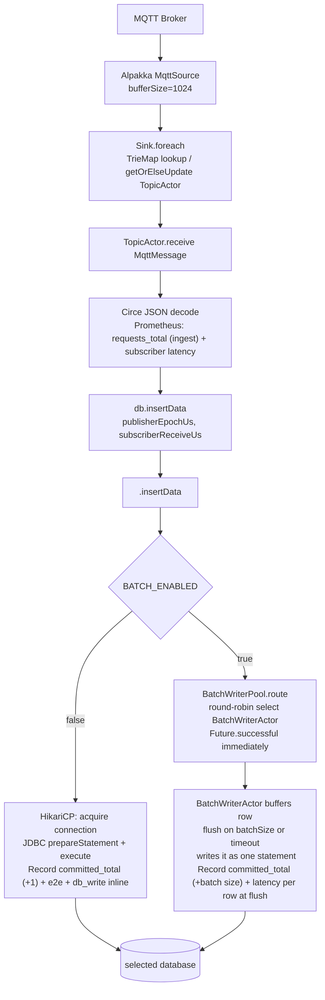
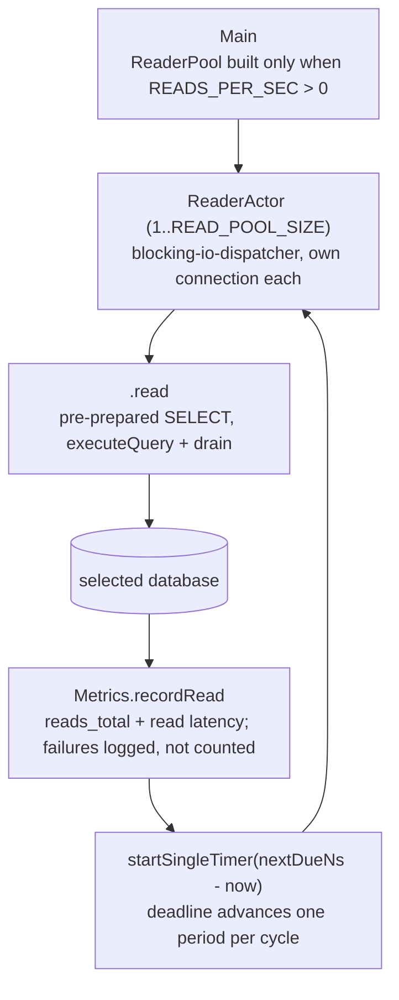
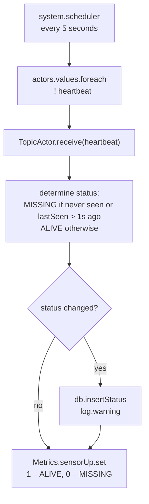

# Service Subscriber

The Service Subscriber is a Scala application that ingests, processes and stores the real-time
telemetry the publishers produce. It is built on
[Pekko Streams](https://pekko.apache.org/docs/pekko/current/stream/index.html) and
[Pekko Actors](https://pekko.apache.org/docs/pekko/current/actor/index.html).

## Core Functionality

1. **Wildcard ingestion.**
   The subscriber connects to the Mosquitto MQTT broker and subscribes to the wildcard topic
   `sensors/#`. One subscriber instance therefore receives the telemetry of every publisher on
   the network.

2. **Dynamic actor creation.**
   The subscriber follows the actor model rather than processing every message in one bottleneck
   process. For each sensor topic it discovers, it spawns a `TopicActor`. That actor holds the
   state of that sensor, which is the cumulative sum, and does its processing.

3. **Data transformation and storage.**
   The subscriber parses each incoming JSON payload with
   [Circe](https://circe.github.io/circe/) and takes the fields it needs. It then writes the
   reading to the database `DB_BACKEND` selects, through the pluggable `DatabaseBackend`.
   `BATCH_ENABLED` decides the path. Writes go through a HikariCP connection pool when batching
   is off, and through a `BatchWriterPool` of `BatchWriterActor` instances when it is on. Latency is
   recorded down in the write path and not in `TopicActor`. It is recorded in the `Future` of the
   backend when batching is off, and in `BatchWriterActor` at flush time when it is on.

4. **Metrics and observability.**
   The service exposes a metrics endpoint for [Prometheus](https://prometheus.io/) to scrape,
   which is what makes the performance of the pipeline visible.

## Message Flow

The read-load path runs only when `READS_PER_SEC` is above 0. It is an independent branch:
nothing in the ingest flow routes to it, and it runs whether or not a sensor is publishing.

The heartbeat path runs every 5 seconds, through `system.scheduler`:

## Architecture

The application is built on the Pekko ecosystem. Each component below is an actor, an object or a
trait in that system.

### Pekko actor system

The root that carries every concurrent process and actor.

### MQTT connector

Alpakka MQTT holds the connection to the Mosquitto broker. Messages arrive through a Pekko Stream,
`MqttSource.atMostOnce`, and `Sink.foreach` dispatches each one to an actor.

### Clock

The one definition of a microsecond wall-clock stamp. Every latency measurement reads the clock
through it. The Erlang arm gets the same from `os:system_time(microsecond)` directly.

### Topic actors (`TopicActor`)

Spawned on demand, one per sensor topic, to hold the state of that sensor and do its processing.
Each receives the `DatabaseBackend` instance through its constructor, so the backend can be
swapped without changing the actor.

`TopicActor` records the ingest count and the subscriber-receive latency. The committed-rows
count and the e2e and db_write latencies are delegated to the write path below it. They are
therefore stamped at the database ack in both batch and non-batch mode.

### Actor registry

A `TrieMap[String, ActorRef]` in `Main` maps a topic string to its actor. `getOrElseUpdate` gives
lock-free creation on first sight of a new topic.

### Write backend trait (`DatabaseBackend`)

The pluggable interface for a database write, with three methods: `insertData`, `insertStatus` and
`close`.

`insertData` takes `publisherEpochUs` and `subscriberReceiveUs`, both in microseconds, which
matches the stamp precision of the publisher. `publisherEpochUs` is both the value written to the
`Timestamp` column, through `Clock.toOffsetDateTime` in whichever backend binds it, and the start
of the e2e measurement. The instant of a reading therefore crosses the interface once, in one
representation.

E2e and db_write latency are recorded at the database ack rather than at the call. The backend
records them at `Future` completion when batching is off, and `BatchWriterActor` records them at
flush time when it is on.

Every implementation must be thread-safe, because one instance is shared across every `TopicActor`
running at the same time. The `Database` object selects the active backend at JVM startup from the
`DB_BACKEND` environment variable.

### Backend selector (`Database`)

An object whose `def backend(implicit system: ActorSystem)` reads `DB_BACKEND` and instantiates
the matching backend. The default is `"timescaledb"`, and it also accepts `"mysql"`, `"influxdb"`,
`"sqlite"` and `"mongodb"`.

`def readTarget` resolves the read side from the same variable and fails in the same way. A
backend name is therefore either supported for both paths or for neither. The implicit
`ActorSystem` is
required by the backends that create child actors. The instance is passed to every `TopicActor` at
construction.

### TimescaleDB backend (`TimescaleDBBackend`)

The `DatabaseBackend` implementation for TimescaleDB. It takes an implicit `ActorSystem`.

Its connection comes from `DbConfig`, in `Database.scala`, which is the one reader of `DB_HOST`,
`DB_PORT`, `DB_NAME`, `DB_USER` and `DB_PASSWORD`. Those are the same five keys the backends of
the Erlang arm read, which is what lets one compose fragment configure both repositories.

`DbConfig.urlFor(driver, params)` assembles the JDBC URL from those keys rather than taking one
whole. The scheme and the connection options belong to the backend, because they are properties of
its driver. `DbConfig` is shared with the read target, so the two can never point at different
databases. The batching factors come from `BatchConfig`, which reads `BATCH_ENABLED`,
`BATCH_SIZE`, `BATCH_TIMEOUT_MS` and `DB_POOL_SIZE` once for every backend.

With `BATCH_ENABLED=false` the backend creates a HikariCP pool of `DB_POOL_SIZE` connections
(default 20) with `prepareThreshold=1`. A statement is therefore prepared server-side from its
first execution rather than from the fifth, which is the pgjdbc default. Each `insertData` call
acquires a connection, executes the statement and releases it. It then records e2e and db_write
latency inline. Writes run on `blocking-io-dispatcher`.

With `BATCH_ENABLED=true` the backend creates one `BatchWriterPool` of `DB_POOL_SIZE`
`BatchWriterActor` instances and supplies a `TimescaleBatchTarget` factory. `insertData` routes an
`InsertRow` to a round-robin selected actor and returns `Future.successful(())` at once. The actor
records latency per message at flush time.

`insertStatus` shares the connections of the data path in both modes. It uses the HikariCP pool
when batching is off, and a round-robin `BatchWriterActor` through the same counter as data when
it is on. `DB_POOL_SIZE` is therefore the total database connection count, which matches the
Erlang arm, where `insert_status` likewise routes over the shared worker pool. A dedicated status pool would
add two connections the Erlang side does not have, and that distorts the pool sweep most at its
smallest value.

### Reader (`ReaderActor`, `ReaderPool`, `ReadConfig`, `ReadTarget`)

The artificial read load, in `Reader.scala`, structured as a mirror of the batching layer.
`ReaderPool` creates `READ_POOL_SIZE` `ReaderActor` instances (default 4) on
`blocking-io-dispatcher`. Each builds its own `ReadTarget` in its constructor, so the JDBC
connection opens on the thread of that actor.

There is no round-robin counter, unlike `BatchWriterPool`, because readers pace themselves rather
than serving traffic from the ingest path. `ReadConfig` is the only reader of `READS_PER_SEC` and
`READ_POOL_SIZE`.

After each read returns, `ReaderActor` arms a single-fire timer against a deadline (`nextDueNs`).
That deadline advances by exactly one period per cycle, clamped so that it is never left in the
past. The period is `1000 × READ_POOL_SIZE ÷ READS_PER_SEC` milliseconds.

Sleeping period-minus-query-time instead leaves every cycle carrying the timer and dispatch
overhead outside the measured read. That overhead is much larger here than in the Erlang arm, so
the two arms ran measurably different read loads at the same `READS_PER_SEC`. Pacing to a deadline
absorbs a constant lateness in full.

Arming from the completion rather than with `startTimerAtFixedRate` means at most one query per
actor is ever in flight. A slow database can therefore never grow the mailbox. When the target
is
unreachable, the achieved rate simply falls below it. That is why `subscriber_reads_total` and not
the configured value is the figure to report.

The read is timed with the monotonic clock, `System.nanoTime`, and not with `Clock`, because it is
a duration rather than a wire timestamp. Mirrors `service_subscriber_reader.erl`, so keep the
pacing formula in sync.

### TimescaleDB read target (`TimescaleReadTarget`)

The JDBC half of a reader: one connection with `prepareThreshold=1` and one pre-prepared
statement, so the read is planned once rather than on every execution. Without that, the group
would measure the query planner.

The query is fixed text with no parameters and no device filter, byte-identical to `?READ_SQL` in
`db_read_backend_timescaledb.erl`. `read()` executes it and drains the single aggregate row. The
values are discarded, but the `ResultSet` is consumed and closed. The measured time therefore
covers the whole round trip, and no cursor is left open.

### Batch writer (`BatchWriterActor`, `BatchWriterPool`, `BatchConfig`, `BatchTarget`)

The backend-agnostic batching layer, in `BatchWriter.scala`. `BatchWriterActor` owns one row
buffer and one `BatchTarget`, and runs on `blocking-io-dispatcher`.

On an `InsertRow` the actor appends to the buffer, and it starts a single-fire timer if the buffer
was empty before. It flushes the buffer when the buffer reaches `batchSize` rows or when the
`BATCH_TIMEOUT_MS` timer fires. `InsertStatus` executes at once and is never buffered.

After a successful flush the actor, and not the target, records e2e and db_write latency for every
row in the batch through `Metrics.recordCommitBatch`. No backend can therefore omit that call or
stamp the ack at a different point. On `postStop` the actor flushes any buffered rows and closes
the target.

`BatchWriterPool` creates `DB_POOL_SIZE` of these actors and owns the round-robin counter that
data and status writes share. This mirrors the buffering in `service_subscriber_db.erl`, which
likewise sits above the backend, so keep the flush triggers in sync.

### TimescaleDB batch target (`TimescaleBatchTarget`)

The JDBC half that a `BatchWriterActor` plugs into: one `DriverManager` connection with
`prepareThreshold=1`, and the two statements it executes.

A flushed buffer is written as a single
`INSERT ... SELECT unnest(?::text[]), unnest(?::int4[]), unnest(?::timestamptz[])`. Those are
three array parameters, so the SQL text is fixed and the statement is prepared once at
construction and reused at any batch size. This mirrors the pre-parsed unnest statement in
`db_backend_timescaledb.erl`. A `VALUES` list would instead rebuild and re-prepare a different
statement on every flush. The batching factors would then measure the JDBC driver rather than the
runtime.

### MySQL backend (`MySQLBackend`)

The `DatabaseBackend` implementation for MySQL 8.4, through Connector/J. It is structurally the
same as `TimescaleDBBackend`, with a HikariCP pool when batching is off and a `BatchWriterPool`
fed a `MySQLBatchTarget` when it is on. It reads the same `DbConfig` and `BatchConfig`.

Two things differ. The pool sets `useServerPrepStmts` and `cachePrepStmts`, which is what
Connector/J reads where pgjdbc reads `prepareThreshold`. The URL carries `connectionTimeZone=UTC`,
which is load-bearing rather than tidiness: MySQL `DATETIME` stores no offset, so without it
Connector/J shifts every bound timestamp by the zone of the JVM. That would leave the latency
metrics correct, because those are computed from the epoch value and never read back. It would
silently empty the bounded window of the read group instead.

### MySQL batch target (`MySQLBatchTarget`)

The JDBC half of a MySQL `BatchWriterActor`. MySQL has no `unnest`, so a flushed buffer is written
as a multi-row `INSERT ... VALUES (?,?,?),(?,?,?),...` built for exactly `BATCH_SIZE` rows and
prepared once at construction. A timeout flush on a partly filled buffer gets a statement built
for its own length, which is the only path that pays a parse.

It deliberately does not use `addBatch` and `executeBatch` with `rewriteBatchedStatements`. That
is a JDBC-only trick with no mysql-otp counterpart, so the two arms would issue structurally
different writes. A multi-row `VALUES` list is available to both, which is the property that
matters.

### MySQL read target (`MySQLReadTarget`)

One connection and one pre-prepared statement, mirroring `TimescaleReadTarget`. The query uses
`NOW(6)` rather than `NOW()` to match the microsecond resolution of the Postgres `now()`, and it
is byte-identical to `?READ_SQL` in `db_read_backend_mysql.erl`. The matching rule is per backend,
so this pair must match each other, not the TimescaleDB pair.

### InfluxDB backend (`InfluxDBBackend`)

The `DatabaseBackend` implementation for InfluxDB 2.7, and the only one that speaks HTTP rather
than JDBC. It adds no dependency, because `java.net.http` is in the JDK.

Its companion object is the shared HTTP half: the write and query URLs, the line-protocol
builders, the readiness probe, and one process-wide `HttpClient`. The write and read paths
therefore cannot diverge, which is the role `DbConfig.urlFor` plays for the JDBC backends.

Three deviations are forced. The client is shared rather than one per writer, because each client
carries a selector thread and its own executor. It pins `HTTP_1_1`, because the default attempts
an `h2c` upgrade and multiplexing would hand this arm wire concurrency `inets` cannot have.
Non-batch concurrency is capped by a `Semaphore(DB_POOL_SIZE)` on `blocking-io-dispatcher` rather
than by a private executor, so the `fixed-pool-size` coupling in `application.conf` keeps holding.

HTTP connects lazily, so the constructor blocks on a readiness probe. That restores the
crash-at-startup a JDBC connect gives for free. A write is an upsert keyed by timestamp, so two
readings from one sensor in the same microsecond overwrite silently while both count as committed.

### InfluxDB batch target (`InfluxBatchTarget`)

Thin next to the JDBC targets. Line protocol has no fixed arity and there is no statement to
prepare, so a flushed buffer is its points joined by newlines and posted. A short timeout flush
therefore costs nothing extra, unlike `MySQLBatchTarget`.

It owns no connection, so `close()` releases nothing. The shared client outlives it, and the
`HttpClient` of JDK 17 is not closeable in any case. Mirrors `insert_batch/2` in
`db_backend_influxdb.erl`.

### InfluxDB read target (`InfluxReadTarget`)

Holds the Flux script, built once with the bucket interpolated, and posts it. `group()` is
required for equivalence with the `avg` and `count` of the SQL backends. Without it, Flux
aggregates per series and returns one row per device. `reduce` computes both aggregates in one
scan.

The response body is read in full, so the measured time covers the whole round trip, as
`MySQLReadTarget` drains its `ResultSet`. Byte-identical to `?READ_FLUX` in
`db_read_backend_influxdb.erl`, and the matching rule is per backend.

### SQLite backend (`SQLiteBackend`)

The `DatabaseBackend` implementation for SQLite, embedded through sqlite-jdbc, so there is no
database container.

Its companion reads `DB_PATH` and `DB_INIT_DIR` instead of the five network keys of `DbConfig`. It
owns two things. `open()` applies the mounted `connection.sql` and the idempotent `init.sql` to
every connection it opens. `withWriteLock` is one fair process-wide `ReentrantLock` that every
write and every connection setup holds. The JVM does not deadlock without that lock, and the
Erlang arm does. Both arms take the same lock, so that they wait for it in the same way.

Non-batch mode does not use HikariCP. sqlite-jdbc caches no prepared statement, so a pooled
connection would parse the INSERT on every row, where the Erlang worker prepares once. The backend
instead keeps `DB_POOL_SIZE` `SQLiteBatchTarget` slots in a queue and borrows one per row on
`blocking-io-dispatcher`. That caps concurrency the way `getConnection` does for the other
backends.

### SQLite batch target (`SQLiteBatchTarget`)

One configured connection with the INSERT and the status statement prepared. A flush is one
`BEGIN IMMEDIATE` transaction of single-row inserts, so it costs one fsync and has no fixed arity.
It is rolled back on any failure, including a failed `COMMIT`. It does not use `addBatch`,
which has no esqlite counterpart. `writeRow` is the single autocommit insert of the non-batch
path.

### SQLite read target (`SQLiteReadTarget`)

One configured connection and the prepared bounded-window SELECT. `Timestamp` holds epoch
microseconds, so the window is computed in that unit. Byte-identical to the SQLite read query of
the Erlang arm.

### MongoDB backend (`MongoDBBackend`)

The `DatabaseBackend` implementation for MongoDB 8.0, through the synchronous Java driver.

Its companion owns what the write and read paths share. Those are the `{w: 1, j: true}` write
concern, the document builders, and two process-wide clients. The write concern means an ack is
the journal fsync that a commit means in the SQL backends. One client serves writes and is sized
to `DB_POOL_SIZE`, and the other serves reads and is sized to `READ_POOL_SIZE`. Each client opens its whole pool at startup and
polls the server over one extra monitoring connection.

The driver connects lazily, so the constructor pings the database, which restores the
crash-at-startup a JDBC connect gives. Non-batch mode runs `insertOne` on
`blocking-io-dispatcher`, capped by the checkout of the pool the way `getConnection` of HikariCP
caps the JDBC backends. The driver holds a connection for one write at a time, while the driver of
the Erlang arm pipelines several on each.

`Data` is a time-series collection whose time field is a BSON Date, so `Clock.toDateMillis` floors
the timestamp of a reading to milliseconds.

### MongoDB batch target (`MongoBatchTarget`)

Thin, like `InfluxBatchTarget`. It borrows a connection from the shared write client per call, so
there is nothing to prepare and nothing to own. A flush is one ordered `insertMany`, so it costs
one journal commit and has no fixed arity. Mirrors `insert_batch/2` in `db_backend_mongodb.erl`.

### MongoDB read target (`MongoReadTarget`)

Holds the aggregate pipeline as JSON text, parsed once, and runs it on the shared read client,
draining the cursor. `$$NOW` keeps the 5-second window on the server clock, as `NOW(6)` does. The
window scans every time-series bucket, so the cost of a read can grow with the number of rows
written. Byte-identical to the MongoDB pipeline of the Erlang arm, and the matching rule is per
backend.

## Metrics Tracking

The service exposes these Prometheus metrics on port `8081`, at the raw endpoint
`http://localhost:8081/metrics`:

- `subscriber_requests_total`: Total MQTT messages ingested. It is incremented on receive, before the row reaches the database.
- `subscriber_committed_total`: Total rows committed to the database. It is incremented on the database write ack, by the batch size in batching mode and by 1 otherwise. Compare it against `subscriber_requests_total`: the two track each other while the database keeps up, and they diverge once the write path saturates.
- `subscriber_request_latency_milliseconds`: Processing time minus sensor timestamp, as a histogram.
- `subscriber_e2e_latency_milliseconds`: Database ack minus sensor timestamp, as a histogram.
- `subscriber_db_write_latency_milliseconds`: Latency from subscriber receive to database write ack, as a histogram.
- `subscriber_reads_total`: Total read queries completed against the database. The readers of the subscriber drive it, and ingest traffic does not, so it stays at `0` unless you set `READS_PER_SEC`. A failed read is logged and left uncounted, so the rate cannot hold steady while queries are failing.
- `subscriber_read_latency_milliseconds`: Latency of one read query, as a histogram.
- `subscriber_sensor_up{device="<name>"}`: Per-sensor liveness gauge, where `1` is ALIVE and `0` is MISSING. It is updated on every heartbeat.
- JVM metrics: the standard metrics for garbage collection, memory use and thread counts.

All four latency metrics are Prometheus histograms over one bucket list of 39 finite bounds, from
0.05 ms to 60 s. That list is byte-identical to the list in the other arm. Both arms therefore
bucket the same observations the same way, and their quantiles are comparable by construction.
`histogram_quantile()` computes a quantile at query time, so any quantile can be recomputed over
any window afterwards. That is what lets the benchmark harness report steady state separately from
the startup transient.

### Reading the quantiles

`histogram_quantile()` interpolates linearly inside a bucket, so a quantile is accurate to at most
the width of the bucket it falls in. That error is bounded, known in advance, and expressed in
milliseconds. A quantile that falls in the `+Inf` bucket returns the highest finite bound, so a
saturated scenario reads as clamped at 60,000 ms.

The `_sum` and `_count` pair covers both cases, because it gives an exact mean that is neither
quantized nor clamped. The benchmark report carries that mean as a column beside every quantile
for this reason.

### One definition of a commit

`Metrics.recordCommit` and `Metrics.recordCommitBatch` are the only places a row is counted as
committed and its latencies observed against the clock of the database ack. Each backend used to
hand-roll that with its own ack stamp. A backend whose stamp drifted then produced a run that
looked healthy and was silently non-comparable.

## Configuration

The service reads these environment variables.

Database connectivity:

- `DB_BACKEND`: Backend implementation: `timescaledb` (default), `mysql`, `influxdb`, `sqlite` or `mongodb`
- `DB_HOST`: Database host. The default is `timescaledb`, and it is `mysql`, `influxdb` or `mongodb` under those backends
- `DB_PORT`: Database port. The default is `5432`, and it is `3306` for MySQL, `8086` for InfluxDB and `27017` for MongoDB
- `DB_NAME`: Database name (default `epu`)
- `DB_USER`: Database user. The default is `postgres`, and it is `root` under `DB_BACKEND=mysql` and `DB_BACKEND=mongodb`
- `DB_PASSWORD`: Database password. The default is `postgres`, and it is `mysql` under `DB_BACKEND=mysql` and `mongo` under `DB_BACKEND=mongodb`
- `DB_ORG` and `DB_TOKEN`: InfluxDB only. The organization and the API token (defaults `epu` and `epu-benchmark-token`). These are the two keys beyond the five that every backend reads
- `DB_PATH` and `DB_INIT_DIR`: SQLite only. The database file and the mounted directory that holds `init.sql` and `connection.sql` (defaults `/var/lib/sqlite/epu.db` and `/sqlite/init`). SQLite reads these instead of the five

The compose fragment of the selected backend supplies all of them. The JDBC scheme is not among
them. `DbConfig.urlFor(driver, params)` assembles the URL, and each backend passes its own scheme
and connection options. The five keys therefore stay identical to the ones the Erlang arm reads.

Write mode:

- `BATCH_ENABLED`: Enable row buffering and batch inserts (default `false`)
- `BATCH_SIZE`: Flush when the buffer reaches this many rows (default `100`)
- `BATCH_TIMEOUT_MS`: Flush after this many milliseconds, even if the buffer is not full (default `1000`)
- `DB_POOL_SIZE`: The HikariCP pool size in non-batch mode, and the number of `BatchWriterActor` instances in batch mode (default `20`)

Read load, through `ReaderPool`:

- `READS_PER_SEC`: Aggregate target read rate across all readers. `0` starts no readers at all (default `0`)
- `READ_POOL_SIZE`: Reader actors, each holding one database connection, so total connections are `DB_POOL_SIZE + READ_POOL_SIZE` while reads are on (default `4`)

## Missing Sensor Detection

The subscriber detects a missing sensor through a heartbeat:

- Every 5 seconds, the scheduler of the main stream sends a `"heartbeat"` message to every active `TopicActor`.
- Each actor compares its `lastSeen` timestamp, taken from the local epoch seconds of the subscriber, against the current time.
- If a sensor has sent no data within the last second, its status becomes `MISSING`. Otherwise it is `ALIVE`.
- A change of status is logged through the actor logger (`log.warning`) and written asynchronously to `sensor_status` in the selected database. This happens only when the status actually changes, so an unchanged status costs no write.

## MQTT Quality of Service

The subscriber connects with QoS 0, which is at-most-once delivery, through `MqttQoS.AtMostOnce`.
Delivery is fire-and-forget with no acknowledgment overhead, which favors throughput and low
latency over guaranteed delivery.
