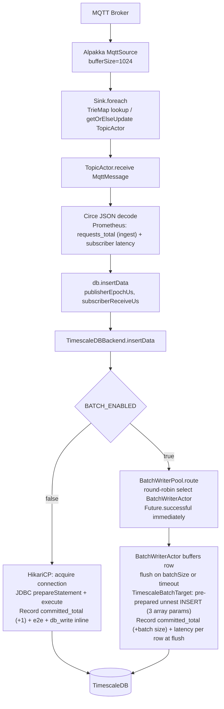
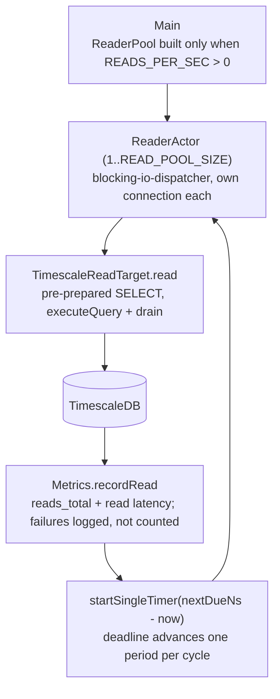
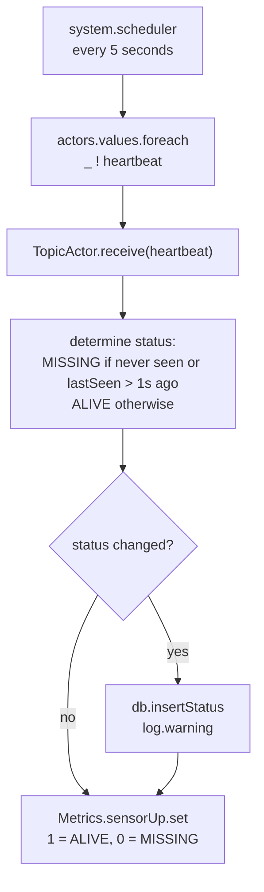

# Service Subscriber

The **Service Subscriber** is a Scala-based application responsible for ingesting, processing, and storing the real-time stream of telemetry data produced by the publishers. It is built using [Pekko Streams](https://pekko.apache.org/docs/pekko/current/stream/index.html) and [Pekko Actors](https://pekko.apache.org/docs/pekko/current/actor/index.html).

## ⚙️ Core Functionality

1. **Wildcard Ingestion:**
   The Subscriber connects to the Mosquitto MQTT Broker and subscribes to the wildcard topic `sensors/#`. This allows a single subscriber instance to receive telemetry data from every publisher on the network.

2. **Dynamic Actor Creation:**
   Instead of processing all messages in a single bottleneck process, the Subscriber utilizes the Actor Model. For every unique sensor topic it discovers, it spawns a dedicated **TopicActor**. This actor manages the state (cumulative sum) and processing for that specific sensor.

3. **Data Transformation & Storage:**
   The Subscriber parses incoming JSON payloads using [Circe](https://circe.github.io/circe/) and extracts the relevant information. It then persists this data into **TimescaleDB** via the pluggable `DatabaseBackend`. Depending on `BATCH_ENABLED`, writes go through a HikariCP connection pool (non-batch) or a `BatchWriterPool` of `BatchWriterActor` instances (batch). Latency recording happens down in the write path — in the backend's `Future` when not batching, in `BatchWriterActor` at flush time when batching — not in `TopicActor`.

4. **Metrics and Observability:**
   The service exposes a metrics endpoint for [Prometheus](https://prometheus.io/) to scrape, providing visibility into the pipeline's performance.

## 📨 Message Flow

Read-load path (only when `READS_PER_SEC > 0`) — an independent branch: nothing in the ingest
flow routes to it, and it runs whether or not any sensor is publishing:

Heartbeat path (every 5 seconds via `system.scheduler`):

## 🏗️ Architecture

The application is built around the **Pekko** ecosystem:

- **Pekko Actor System**: The root for managing all concurrent processes and actors.
- **MQTT Connector**: Utilizes Alpakka MQTT for robust connectivity to the Mosquitto broker. Messages arrive via a Pekko Stream (`MqttSource.atMostOnce`) and are dispatched to actors via `Sink.foreach`.
- **Clock**: The single definition of a microsecond wall-clock stamp; every latency measurement reads the clock through it. The Erlang arm gets the same from `os:system_time(microsecond)` directly.
- **Topic Actors (`TopicActor`)**: Dynamically spawned actors that handle state management and processing per sensor topic. They receive the `DatabaseBackend` instance via constructor injection, so the backend can be swapped without modifying the actor. `TopicActor` records the ingest count and subscriber-receive latency; **the committed-rows count and the e2e/db_write latency recording are delegated to the write path below it** so they are stamped at the DB ack in both batch and non-batch modes.
- **Actor Registry**: A `TrieMap[String, ActorRef]` in `Main` maps topic strings to their actor. `getOrElseUpdate` is used for lock-free creation on first sight of a new topic.
- **DB Backend Trait (`DatabaseBackend`)**: A trait defining the pluggable interface for database writes — `insertData`, `insertStatus`, and `close`. `insertData` takes `publisherEpochUs` and `subscriberReceiveUs` (microseconds, matching the publisher's stamp precision). `publisherEpochUs` is both the value written to the `Timestamp` column — via `Clock.toOffsetDateTime` in whichever backend binds it — and the start of the e2e measurement, so the reading's instant crosses the interface once, in one representation. E2e and db_write latency are recorded at the DB ack rather than at the call — by the backend at `Future` completion in non-batch mode, and by `BatchWriterActor` at flush time in batch mode. All implementations must be thread-safe, as the single instance is shared across all `TopicActor` instances running concurrently. The active backend is selected at JVM startup by the `Database` object via the `DB_BACKEND` environment variable.
- **DB Backend Selector (`Database`)**: An object with a `def backend(implicit system: ActorSystem)` that reads `DB_BACKEND` (default: `"timescaledb"`) and instantiates the matching backend. The `ActorSystem` implicit is required by backends that create child actors. The instance is passed to every `TopicActor` at construction time.
- **TimescaleDB Backend (`TimescaleDBBackend`)**: The concrete implementation of `DatabaseBackend` for TimescaleDB. Takes an implicit `ActorSystem`. It reads only `DB_URL` / `DB_USER` / `DB_PASSWORD`; the batching factors come from `BatchConfig`, which reads `BATCH_ENABLED`, `BATCH_SIZE`, `BATCH_TIMEOUT_MS` and `DB_POOL_SIZE` once for every backend.
  - **Non-batch mode** (`BATCH_ENABLED=false`): creates a HikariCP pool of `DB_POOL_SIZE` connections (default 20) with `prepareThreshold=1`, so statements are server-side prepared from their first execution rather than pgjdbc's default fifth. Each `insertData` call acquires a connection, executes the statement, releases it, then records e2e and db_write latency inline. Writes run on `blocking-io-dispatcher`.
  - **Batch mode** (`BATCH_ENABLED=true`): creates one `BatchWriterPool` of `DB_POOL_SIZE` `BatchWriterActor` instances, supplying a `TimescaleBatchTarget` factory. `insertData` routes an `InsertRow` to a round-robin selected actor and returns `Future.successful(())` immediately. Latency is recorded per message at flush time inside the actor.
  - **Status writes**: `insertStatus` shares the data path's connections in both modes — the HikariCP pool in non-batch mode, a round-robin `BatchWriterActor` (via the same counter as data) in batch mode. `DB_POOL_SIZE` is therefore the total PostgreSQL connection count, matching the Erlang arm, where `insert_status` likewise routes over the shared worker pool. A dedicated status pool would add two connections the Erlang side does not have, which distorts the pool sweep most at its smallest value.
- **Reader (`ReaderActor`, `ReaderPool`, `ReadConfig`, `ReadTarget`)**: The **artificial read load**, in `Reader.scala`, structured as a mirror of the batching layer. `ReaderPool` creates `READ_POOL_SIZE` `ReaderActor` instances (default 4) on `blocking-io-dispatcher`, each building its own `ReadTarget` in its constructor so the JDBC connection opens on that actor's own thread. There is **no round-robin counter**, unlike `BatchWriterPool`: readers pace themselves rather than serving traffic from the ingest path. `ReadConfig` is the only reader of `READS_PER_SEC` and `READ_POOL_SIZE`. After each read returns, `ReaderActor` arms a single-fire timer against a **deadline** (`nextDueNs`) that advances by exactly one period (`1000 × READ_POOL_SIZE ÷ READS_PER_SEC`) per cycle, clamped so it is never left in the past. Sleeping period-minus-query-time instead left every cycle carrying ≈20ms of timer/dispatch overhead here against ≈1ms in the Erlang arm, so the two arms ran measurably different read loads at the same `READS_PER_SEC`; pacing to a deadline absorbs a constant lateness entirely. Arming from the completion rather than with `startTimerAtFixedRate` means at most one query per actor is ever in flight, so a slow database can never grow the mailbox — when the target is unreachable the achieved rate simply falls below it, which is why `subscriber_reads_total` and not the configured value is the figure to report. The read is timed with the monotonic clock (`System.nanoTime`), not `Clock`, since it is a duration rather than a wire timestamp. Mirrors `service_subscriber_reader.erl` — keep the pacing formula in sync.
- **TimescaleDB read target (`TimescaleReadTarget`)**: The JDBC half of a reader — one connection with `prepareThreshold=1` and one pre-prepared statement, so the read is planned once rather than on every execution; without that the group would be measuring the query planner. The query is fixed text with no parameters and no device filter, byte-identical to `?READ_SQL` in `db_read_backend_timescaledb.erl`. `read()` executes it and drains the single aggregate row: the values are discarded, but the `ResultSet` is consumed and closed so the measured time covers the whole round-trip and no cursor is left open.
- **Batch writer (`BatchWriterActor`, `BatchWriterPool`, `BatchConfig`, `BatchTarget`)**: The backend-agnostic batching layer, in `BatchWriter.scala`. `BatchWriterActor` owns one row buffer and one `BatchTarget`, and runs on `blocking-io-dispatcher`. When it receives an `InsertRow` it appends to the buffer and starts a single-fire timer if the buffer was previously empty; the buffer is flushed when it reaches `batchSize` rows or the `BATCH_TIMEOUT_MS` timer fires. `InsertStatus` is executed immediately rather than buffered. After a successful flush the actor — not the target — records e2e and db_write latency for every row in the batch via `Metrics.recordCommitBatch`, so no backend can omit that call or stamp the ack at a different point. On `postStop` any remaining buffered rows are flushed and the target is closed. `BatchWriterPool` creates `DB_POOL_SIZE` of these actors and owns the round-robin counter shared by data and status writes. This mirrors the buffering in `service_subscriber_db.erl`, which likewise sits above the backend — keep the flush triggers in sync.
- **TimescaleBatchTarget**: The JDBC half a `BatchWriterActor` plugs into: one `DriverManager` connection with `prepareThreshold=1`, and the two statements it executes. A flushed buffer is written as a single `INSERT ... SELECT unnest(?::text[]), unnest(?::int4[]), unnest(?::timestamptz[])` — three array parameters, so the SQL text is fixed and the statement is prepared once at construction and reused at any batch size. This mirrors the pre-parsed unnest statement in `db_backend_timescaledb.erl`; a `VALUES` list would instead rebuild and re-prepare a different statement on every flush, making the batching factors measure the JDBC driver rather than the runtime.

## 📊 Metrics Tracking

The service exposes the following Prometheus metrics on port `8081` (raw endpoint: `http://localhost:8081/metrics`):

- `subscriber_requests_total`: Total count of MQTT messages **ingested** — incremented on receive, before the row reaches the database.
- `subscriber_committed_total`: Total rows **committed** to the database — incremented on the DB write ack (by the batch size in batching mode, by 1 otherwise). Compare against `subscriber_requests_total`: the two track each other while the DB keeps up, and diverge once the write path saturates.
- `subscriber_request_latency_milliseconds`: Latency (processing time − sensor timestamp), as a histogram.
- `subscriber_e2e_latency_milliseconds`: End-to-end latency (DB ack − sensor timestamp), as a histogram.
- `subscriber_db_write_latency_milliseconds`: Latency from subscriber receive to DB write ack, as a histogram.
- `subscriber_reads_total`: Total read queries **completed** against the database. Driven by the subscriber's own readers rather than by ingest traffic, so it stays at `0` unless `READS_PER_SEC` is set. Failed reads are logged and left uncounted, so the rate cannot hold steady while queries are erroring out.
- `subscriber_read_latency_milliseconds`: Latency of one read query, as a histogram.
- `subscriber_sensor_up{device="<name>"}`: Per-sensor liveness gauge — `1` = ALIVE, `0` = MISSING. Updated every heartbeat.
- **JVM Metrics**: Standard metrics for garbage collection, memory usage, and thread counts.

All four latency metrics are Prometheus **histograms** over one bucket list (39 finite bounds from
0.05 ms to 60 s) that is byte-identical to the other repo's, so both arms bucket the same
observations the same way and quantiles are comparable by construction. Quantiles are computed at
query time with `histogram_quantile()`, which means any quantile can be recomputed over any window
after the fact — that is what lets the benchmark harness report steady state separately from the
startup transient.

> **Reading the quantiles.** `histogram_quantile()` interpolates linearly inside a bucket, so a
> quantile is accurate to at most the width of the bucket it falls in — bounded, known in advance,
> and bounded in *milliseconds*. A quantile falling in the `+Inf` bucket returns the highest finite
> bound, so a saturated scenario reads as clamped at 60,000 ms. Both are covered by the `_sum` /
> `_count` pair, which gives an exact mean that is neither quantized nor clamped; the benchmark
> report carries it as a column beside every quantile for exactly this reason.

`Metrics.recordCommit` / `recordCommitBatch` are the only places a row is counted as committed and
its latencies observed against the DB ack clock. Each backend used to hand-roll that with its own
ack stamp, so one that drifted produced a run that looked healthy and was silently non-comparable.

## ⚙️ Configuration

The service uses the following environment variables:

**Database connectivity:**
- `DB_BACKEND`: Backend implementation (default: `timescaledb`)
- `DB_URL`: JDBC URL (default: `jdbc:postgresql://timescaledb:5432/epu`)
- `DB_USER`: Database user (default: `postgres`)
- `DB_PASSWORD`: Database password (default: `postgres`)

**Write mode (`TimescaleDBBackend`):**
- `BATCH_ENABLED`: Enable row buffering / batch inserts (default: `false`)
- `BATCH_SIZE`: Flush when the buffer reaches this many rows (default: `100`)
- `BATCH_TIMEOUT_MS`: Flush after this many ms even if the buffer is not full (default: `1000`)
- `DB_POOL_SIZE`: HikariCP pool size in non-batch mode; number of `BatchWriterActor` instances in batch mode (default: `20`)

**Read load (`ReaderPool`):**
- `READS_PER_SEC`: Aggregate target read rate across all readers; `0` starts no readers at all (default: `0`)
- `READ_POOL_SIZE`: Reader actors, each holding one PostgreSQL connection, so total connections are `DB_POOL_SIZE + READ_POOL_SIZE` while reads are on (default: `4`)

## 🔍 Missing Sensor Detection

The Subscriber implements a heartbeat-based missing sensor detection system:

- Every **5 seconds**, the main stream scheduler sends a `"heartbeat"` message to all active `TopicActor` instances.
- Each actor compares its `lastSeen` timestamp (captured using the subscriber's local epoch seconds) against the current time.
- If a sensor has not sent data within the last second, its status transitions to `MISSING`; otherwise it is `ALIVE`.
- State changes are logged via the actor logger (`log.warning`) and persisted asynchronously to the `sensor_status` table in TimescaleDB, but only when the status actually changes to avoid unnecessary writes.

## 📡 MQTT Quality of Service

The subscriber connects with **QoS 0 (At Most Once)** via `MqttQoS.AtMostOnce`. This provides fire-and-forget delivery with no acknowledgment overhead, prioritizing throughput and low latency over guaranteed delivery.
